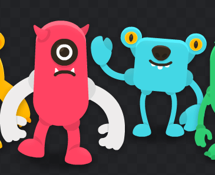

# lucas-bonneau-tp1

## Description de la scene

La scène sera composée de 6 personnages qui seront activés par les touches QWERTY du clavier. Chaque personnage sera attribué à une des touches, et lorsque l'utilisateur cliquera sur l'une des touches, le personnage se lèvera et fera un bruit musical.

## Description des visuel

Les personnages seront de petits monstres trouvés dans Keney, qui bougeront lorsqu'on les active : ils ouvriront la bouche et bougeront les bras.

## Description sonore

Les sons seront des bruits mélodiques ou des instruments de musique qui fonctionneraient bien en harmonie le but serais de faire une mélodie avec les monstres.

