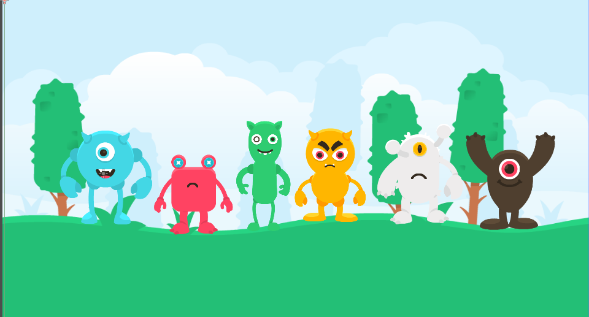

## Photo du prototype du jeu

## script

#### Voici le script

extends Node2D

@onready var SonMonstreBleu = $SonMonstreBleu

func _input(_event):
	if Input.is_action_just_pressed("jouer_son_bleu"):
		print("Action détectée !")
		$SonMonstreBleu.play()
  -------------------------------------

